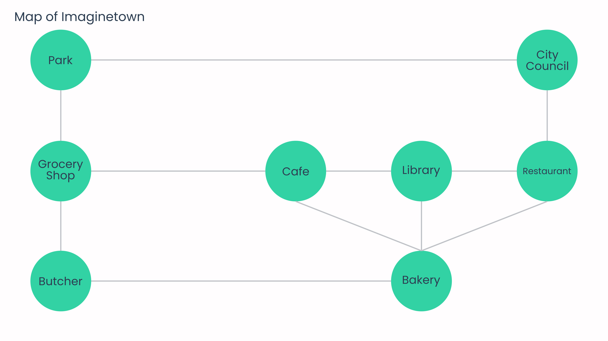

 # Introduction
 This is my Data Structures and Algorithms repository. It is intended to demonstrate some commonly used Data Structures and Algorithms implementation using the Java programming language. Computer Science students in their freshman year might find it very useful. If you don't understand any of the implementation or need more clarification please send me an email at [contact@abdullahhassan.dev](mailto:contact@abdullahhassan.dev).

 # Run
 The **Test.java** class contains all test cases. Run the *main* method to see all test runs.

 # Graph
 Graph used for the BFS and DFS algorithm example. This  is a map of an imaginary town called Imaginetown. Each **Node** represents an establishment in the town and shows the name of that establishment. A line represents a road or a neighbouring connection between the buildings. For example, City Council has two neighbors, the Park and the Restaurant.
 
 
